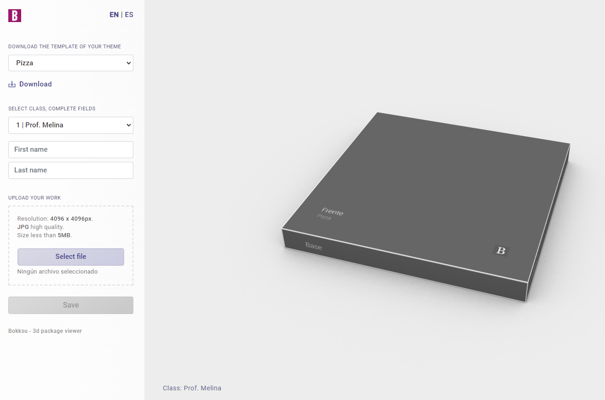

# bokksu
*(meaning "box" in japanese)*

Interactive system that can be used to display 3d packages. 

[A working demo can be found here](https://packaging.gzalo.com/). 

Used for academic purposes (displaying work of students during the pandemic):
- [Cátedra Belluccia](http://catedrabelluccia.com.ar/) in [FADU, Universidad de Buenos Aires](http://www.fadu.uba.ar/)

Technical details:
- Static frontend developed with [Vue.js](https://vuejs.org/) + [Three.js](https://threejs.org/)
- Hosted on [Cloudflare Pages](https://pages.cloudflare.com/)
- Backend using [Clouflare Workers](https://workers.cloudflare.com/) and Workers KV for storing submissions (both JSON data and the actual files)
